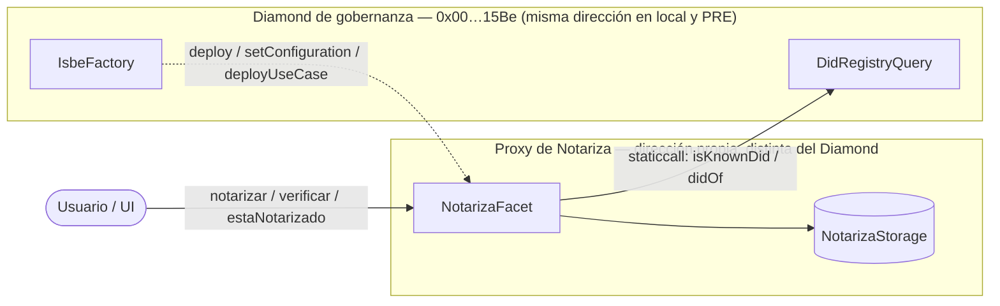
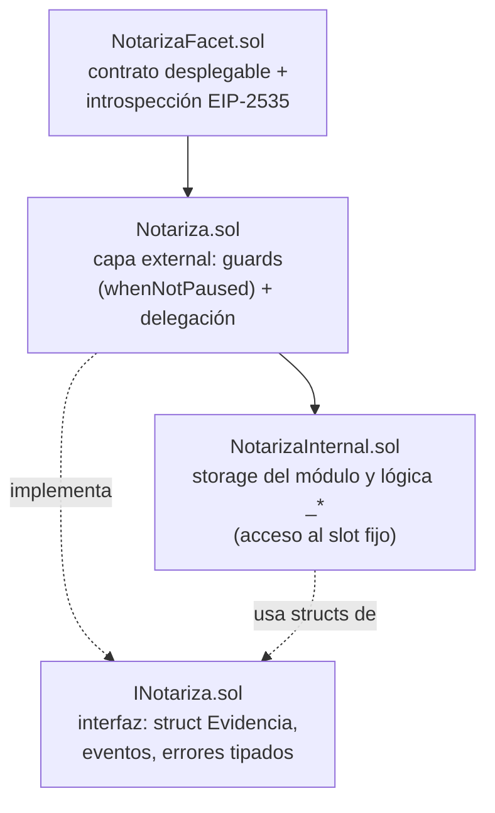

# notariza-contracts

Notariza sella on-chain el hash de un documento junto con quién lo presentó y cuándo, exigiendo
una identidad activa en Red ISBE (un DID en su `DidRegistry`). El documento en sí nunca sale del
navegador del usuario: solo su hash llega a la cadena.

Este repositorio contiene el módulo Solidity — el contrato — desplegado bajo la **Modalidad 1**
de ISBE (patrón Diamond, EIP-2535). Es el repo hermano de
[`notariza-ui`](https://github.com/Dezen-code-the-trust/notariza-ui), que consume el ABI
publicado aquí ([`abi/INotariza.json`](abi/INotariza.json)) como interfaz web.

Es un proyecto Hardhat autocontenido: se clona, se instala y compila por sí solo. Para ejecutar
los tests y el despliegue hace falta además la red local de ISBE, que se levanta desde el
template oficial clonado aparte (ver [`docs/entorno-local.md`](docs/entorno-local.md)).

## Arquitectura

El Diamond de gobernanza de ISBE y el proxy del caso de uso de Notariza son contratos distintos,
en direcciones distintas. El proxy consulta la identidad del emisor contra el Diamond con una
llamada externa de solo lectura (`staticcall`), nunca `delegatecall`:



El módulo, como toda faceta de Modalidad 1, se estructura en 4 ficheros con responsabilidades
que no se solapan:



Detalle completo — por qué Modalidad 1, el flujo de identidad, el storage no estructurado, los 3
pasos de despliegue y las reglas del patrón que no se pueden romper — en
[`docs/arquitectura.md`](docs/arquitectura.md).

## Interfaz pública

| Función | Selector | Tipo | Guard |
|---|---|---|---|
| `notarizar(bytes32)` | `0x0be1447f` | escritura | `whenNotPaused` + identidad ISBE del emisor |
| `verificar(bytes32)` | `0xa1eda2f2` | `view` | ninguno — lectura pública |
| `estaNotarizado(bytes32)` | `0x21fa9d8a` | `view` | ninguno — lectura pública |

Los tres selectores están declarados en `selectorsIntrospection()` de `NotarizaFacet.sol` y
`test/notariza/introspeccion.test.ts` los compara automáticamente contra la ABI compilada: una
función `external` que falte en esa lista compila y despliega sin error, pero no es enrutable a
través del proxy.

> Los valores de la columna *Selector* deben verificarse contra la ABI compilada antes de
> publicar el expediente: `node -p "new (require('ethers').Interface)(require('./abi/INotariza.json')).fragments.filter(f=>f.type==='function').map(f=>f.name+' '+f.selector)"`

## Instalación y uso

```bash
npm install
cp .env_sample .env
npx hardhat compile
```

Para tests y despliegue hace falta la red local levantada:

```bash
npx hardhat test --network isbe
npx hardhat run scripts/deployNotariza.ts --network isbe
```

Guía completa, paso a paso, incluido cómo levantar la red desde el template de ISBE, en
[`docs/entorno-local.md`](docs/entorno-local.md).

## Build reproducible

Dependencias con versión exacta y `package-lock.json` versionado. `solc 0.8.28`,
`evmVersion: istanbul`, optimizador a 200 runs, fijados en `hardhat.config.ts`.

```bash
npm ci
npx hardhat compile
npm run standard-input      # entrada estándar de verificación (Blockscout/Etherscan)
```

Detalle y verificación de igualdad de bytecode en la sección 8 de
[`docs/entorno-local.md`](docs/entorno-local.md).

## Estructura del repositorio

```
├── contracts/
│   ├── constants/constants.sol      — namespace, resolver key, config id, rol admin, Diamond
│   ├── notariza/
│   │   ├── INotariza.sol            — interfaz: struct Evidencia, eventos, errores
│   │   ├── NotarizaInternal.sol     — storage del módulo y lógica interna
│   │   ├── Notariza.sol             — capa external: guards + delegación
│   │   └── NotarizaFacet.sol        — contrato desplegable, introspección EIP-2535
│   └── testwrapper/notariza/
│       ├── NotarizaTestWrapper.sol  — expone la lógica interna para tests unitarios
│       └── NotarizaFacetV2.sol      — v2 de prueba, solo para el test de upgrade
├── scripts/
│   ├── deployNotariza.ts            — despliegue en 3 pasos contra el Diamond
│   ├── validateNotariza.ts          — checklist de validación post-despliegue
│   ├── registerTestDid.ts           — registra DID de prueba en la red local
│   └── checkStorage.ts              — verificación empírica del slot de storage
├── test/
│   ├── constants.test.ts            — cada constante == keccak256 de su string
│   ├── helpers/                     — despliegue, cuentas de prueba, constantes compartidas
│   └── notariza/                    — unitarios, integración, introspección, upgrade
├── docs/
│   ├── arquitectura.md              — diseño técnico y reglas del patrón
│   ├── entorno-local.md             — cómo levantar la red, compilar, desplegar y validar
│   ├── despliegue.md                — parámetros de despliegue y checklist
│   └── slither-report.md            — informe de análisis estático
├── abi/INotariza.json               — ABI de release, consumido por notariza-ui
├── hardhat.config.ts                — solc 0.8.28, istanbul, optimizador 200 runs
├── package.json                     — dependencias con versión exacta
├── package-lock.json                — resolución fijada (build reproducible)
└── LICENSE                          — Apache-2.0
```

## Documentación

- [`docs/arquitectura.md`](docs/arquitectura.md) — diseño técnico: por qué Modalidad 1, el
  Diamond de gobernanza frente al proxy, el flujo de identidad, el storage no estructurado y las
  reglas del patrón.
- [`docs/entorno-local.md`](docs/entorno-local.md) — instalación, red local de ISBE, compilación,
  despliegue, tests, validación y build reproducible.
- [`docs/despliegue.md`](docs/despliegue.md) — parámetros de despliegue (namespace, mapa de
  roles) y checklist de validación post-despliegue.
- [`docs/slither-report.md`](docs/slither-report.md) — informe de análisis estático.

## Licencia

Apache-2.0. Ver [`LICENSE`](LICENSE).