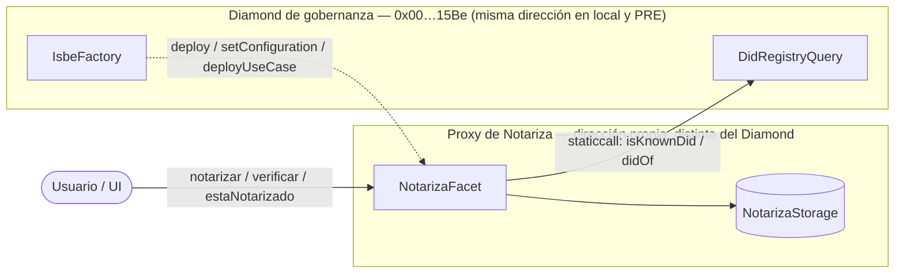
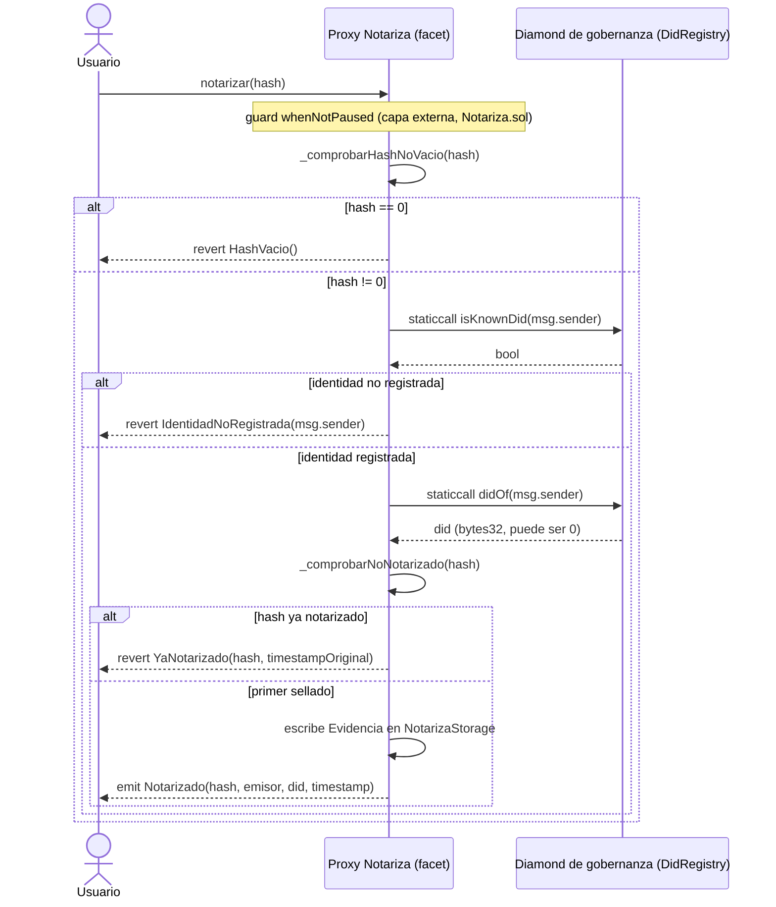

# Arquitectura — Notariza

Explicación del módulo Notariza para quien no conoce Red ISBE ni el patrón Diamond, y referencia
técnica de su arquitectura: por qué Modalidad 1, cómo se relaciona el proxy con el Diamond de
gobernanza, cómo funciona su storage y qué reglas del patrón no se pueden romper sin que falle en
silencio. Para las convenciones de código y las reglas que sigue este repo al escribir contratos,
ver `CLAUDE.md`.

## 1. Qué es y para quién

Notariza es un módulo de notarización de documentos: sella on-chain el hash de un documento,
junto con quién lo selló y cuándo, exigiendo que quien notariza tenga una identidad ISBE activa
(un DID registrado en el `DidRegistry` de la Red ISBE). El documento en sí nunca llega a la
cadena — solo su hash, calculado en el navegador antes de cualquier transacción.

Este documento está pensado para dos lectores: ISBE evaluando la solicitud de homologación de
Dezen, y cualquier desarrollador que necesite integrar la UI o auditar el contrato sin haber
trabajado antes con el patrón Diamond de ISBE.

Qué **no** es: no es un sistema de custodia de documentos (el fichero nunca sale de la máquina
del usuario) y no guarda datos personales on-chain — solo hashes y DIDs.

## 2. Los 4 ficheros y su responsabilidad

Modalidad 1 de ISBE = una faceta (*facet*) del patrón Diamond (EIP-2535): en vez de un contrato
autocontenido, la lógica se despliega como una pieza que un proxy compartido enruta por
selector de función. Eso obliga a separar el módulo en capas, cada una con una responsabilidad
que no se solapa con las demás:

| Fichero | Contiene | Por qué está separado |
|---|---|---|
| `INotariza.sol` | El struct `Evidencia`, los eventos y los errores tipados, las firmas de las funciones públicas | Es el contrato de interfaz: lo que consume la UI y lo que se publica como ABI de release. Sin lógica, para que cambiar la implementación no obligue a cambiar lo que ya integran terceros. |
| `NotarizaInternal.sol` | El struct de storage del módulo, el acceso a su slot, y todas las funciones `_*` con la lógica real | Aquí vive el estado y el comportamiento. Se mantiene `internal` para que `NotarizaTestWrapper` pueda probar la lógica sin desplegar el proxy completo. |
| `Notariza.sol` | La capa `external`: los guards (`whenNotPaused`) y la delegación a las funciones internas | Separa "qué puede impedir que se ejecute la lógica" (guards) de "qué hace la lógica" — cambiar un guard no toca `NotarizaInternal`. |
| `NotarizaFacet.sol` | El contrato que efectivamente se despliega, con las tres funciones de introspección que exige el proxy de ISBE | Es el punto de entrada real del Diamond: nunca se llama directamente, todas las invocaciones pasan por el proxy del caso de uso. |
| `testwrapper/notariza/NotarizaTestWrapper.sol` | Helpers de inicialización y pausa para tests unitarios | Expone la lógica interna sin pasar por el proxy ni por la infraestructura de gobernanza. Nunca se despliega en producción. |

## 3. Por qué Modalidad 1 / patrón Diamond

Modalidad 1 es la vía de despliegue de ISBE basada en el patrón Diamond (EIP-2535): en vez de
desplegar un contrato autocontenido, se registra la lógica de negocio (el *facet*) en la
factoría del Diamond de gobernanza, que es quien crea y gestiona el proxy del caso de uso. Según
la documentación pública del template (`isbe-clients-template`), eso tiene tres consecuencias
directas:

- La dirección del proxy la asigna el Diamond al desplegarlo, no quien envía la transacción.
- El storage del proxy persiste entre actualizaciones de la lógica: pasar de una versión del
  facet a otra no reinicia el estado (`test/notariza/upgrade.test.ts` lo comprueba
  explícitamente).
- Actualizar la lógica es registrar una nueva versión del bytecode (pasos 1 y 2 de la sección 7)
  sin volver
  a desplegar el proxy ni migrar datos.

En la práctica, quién ejecuta esas tres transacciones frente al Diamond de gobernanza depende del
entorno: en la red local las ejecuta la cuenta admin propia (ver la sección 7); en ISBE PRE las
ejecuta
ISBE, con los parámetros que Dezen le entrega en la solicitud de homologación. Para el detalle de
qué modalidades de despliegue ofrece ISBE y qué agente participa en cada una, ver la
documentación oficial de ISBE (`docs.redisbe.com`) sobre modalidades de despliegue.

## 4. Arquitectura: Diamond de gobernanza vs. proxy del caso de uso

La confusión más probable de quien llega nuevo al proyecto: el Diamond de gobernanza de ISBE
(`0x00000000000000000000000000000000000015Be`, la misma dirección en la red local y en PRE) y
el proxy de Notariza **son contratos distintos, en direcciones distintas**.

El Diamond de gobernanza aloja la factoría (`IsbeFactory`, que registra y despliega facets) y el
`DidRegistry` (donde viven las identidades ISBE). El proxy de Notariza es un contrato propio,
con su propio storage, que la factoría despliega *a partir de* la lógica registrada en el
Diamond — pero que vive en su propia dirección. Cuando el proxy necesita saber si una cuenta
tiene una identidad ISBE activa, hace una llamada externa (`staticcall`) al Diamond de
gobernanza; nunca accede a su storage ni ejecuta su código en el propio contexto
(`delegatecall`).



## 5. Flujo de `notarizar()`

`notarizar` es la única función de escritura del módulo, y la única con gate de identidad.
`verificar` y `estaNotarizado` son de lectura pública, sin gate.



Dos detalles que no son evidentes leyendo solo el código:

- **`staticcall`, no `delegatecall`.** La consulta de identidad lee estado del Diamond de
  gobernanza, no del proxy. Un `delegatecall` ejecutaría el código del Diamond usando el storage
  del proxy — corrompiéndolo. `staticcall` además impide que esa llamada externa modifique nada,
  ni en el Diamond ni en el proxy.
- **`did = 0` con identidad conocida se acepta como resultado válido, aunque hoy no es
  alcanzable contra el DidRegistry real.** `isKnownDid()` y `didOf()` comparten el mismo guard
  de `capabilityInvocation` en `@red-isbe/isbe-contracts` v0.2.1: si `isKnownDid == true`,
  `didOf` nunca devuelve `0`, ni en local ni en PRE. La comprobación se mantiene como
  salvaguarda defensiva ante un cambio futuro de ese acoplamiento en la librería — si algún día
  deja de darse esa garantía, la evidencia seguiría guardándose correctamente, válida por
  `msg.sender`, que es lo que de verdad prueba la autoría.

## 6. Storage no estructurado: slot fijo y por qué es irreversible

El módulo usa el patrón de *storage no estructurado* (unstructured storage): en vez de dejar que
el compilador asigne las posiciones de storage en el orden en que declara las variables — lo
habitual en un contrato autocontenido —, `NotarizaStorage` se ancla a mano a un slot fijo,
calculado como el `keccak256` de un string de namespace:

```solidity
bytes32 constant _NOTARIZA_STORAGE_POSITION = keccak256('isbe.customers.dezen.notariza.storage');
```

`_notarizaStorage()`, en `NotarizaInternal.sol`, usa ese valor con `assembly` para apuntar el
struct de storage a esa posición exacta (`storage_.slot := position`) — el único uso de
`assembly` en el módulo, y por eso está señalizado con `slither-disable-start/end assembly` en
vez de silenciado globalmente. El motivo del patrón es evitar colisiones: en el patrón Diamond
varias facetas comparten el mismo storage del proxy, así que si dos módulos usaran la asignación
secuencial por defecto, sus variables podrían acabar en el mismo slot sin que nada lo detecte en
tiempo de compilación. Anclar cada módulo a un slot derivado de un string único (el namespace)
hace que la colisión sea, en la práctica, tan improbable como una colisión de `keccak256`.

`scripts/checkStorage.ts` verifica esto empíricamente contra un proxy desplegado: lee con
`eth_getStorageAt` el slot `keccak256(abi.encode(hash, _NOTARIZA_STORAGE_POSITION))` — la
posición estándar de un valor de `mapping` en Solidity — y comprueba que coincide con lo que
devuelve `verificar()`; después comprueba que los primeros slots secuenciales (0, 1, 2…) están
vacíos, es decir, que no hay ninguna variable de estado suelta fuera del struct que pudiera
colisionar con otra faceta.

**Por qué es irreversible una vez desplegado:** el valor de `_NOTARIZA_STORAGE_POSITION` no es un
identificador simbólico — es literalmente la dirección donde vive el struct de storage completo
del módulo. Cambiarlo después de desplegar (por ejemplo, para "limpiar" el namespace o corregir
una errata) no mueve los datos: hace que el módulo pase a leer un slot distinto, vacío, mientras
que la evidencia ya sellada sigue físicamente en el slot antiguo, ahora inalcanzable desde
`_notarizaStorage()`. No hay una migración posible sin un mecanismo explícito de copia de un slot
a otro, que el módulo no implementa. Por eso la constante lleva el comentario `INMUTABLE una vez
desplegado` en `constants.sol`, y por eso ninguna de las tres transacciones de despliegue
(sección 7)
permite cambiarla: queda fijada en el bytecode del facet en el momento del `deploy`.

## 7. Despliegue en 3 pasos

Todo el despliegue pasa por la factoría del Diamond de gobernanza, en tres transacciones
secuenciales: registrar el bytecode, fijar una configuración que lo referencia, y crear el proxy
del caso de uso a partir de esa configuración.

```mermaid
sequenceDiagram
    actor Admin as Cuenta admin (Dezen en local / ISBE en PRE)
    participant Factory as IsbeFactory (Diamond de gobernanza)

    Admin->>Factory: deploy(resolverKey, bytecode de NotarizaFacet)
    Factory-->>Admin: event Deployed(businessAddress, version)

    Admin->>Factory: setConfiguration(configId, [{businessId: resolverKey, version}])
    Factory-->>Admin: event ConfigurationSet(version)

    Admin->>Factory: deployUseCase(configId, 0, rbacs, false, [], [])
    Note right of Factory: rechaza DEFAULT_ADMIN_ROLE / _ISBE_ROLE /<br/>_CONFIGURATION_MANAGER_ROLE si se piden<br/>explícitamente en rbacs; los concede ella misma<br/>a quien envía la transacción
    Factory-->>Admin: event UseCaseDeployed(proxy)
```

En local lo ejecuta la cuenta admin de Hardhat; en PRE lo ejecuta ISBE con los mismos
parámetros (ver la sección 3). El despliegue en red local es, en ese sentido, el ensayo general
de lo que
se pide en el expediente: los mismos tres pasos, con los mismos parámetros de namespace,
ejecutados sobre la misma factoría.

## 8. Mapa de roles y su origen

Al construir `rbacs` para `deployUseCase` solo se pueden pasar los roles que la factoría
permite fijar: `PAUSER_ROLE` y `_NOTARIZA_ADMIN_ROLE`. `DEFAULT_ADMIN_ROLE` no se solicita — la
factoría lo rechaza con `ForbiddenRole` si se pide explícitamente, y lo concede ella misma a
quien envía la transacción `deployUseCase`.

La consecuencia práctica es la que le importa al expediente: en PRE, quien ejecuta
`deployUseCase` es ISBE, no Dezen. Sin `DEFAULT_ADMIN_ROLE` no se pueden conceder roles después
del despliegue, así que el mapa de roles queda congelado en lo que se pida en ese momento. La
solicitud a ISBE debe pedir explícitamente lo que Dezen necesite: las EOAs de Dezen en
`PAUSER_ROLE` y `_NOTARIZA_ADMIN_ROLE` desde el primer momento, o una concesión posterior de
`DEFAULT_ADMIN_ROLE`.

## 9. Reglas innegociables del patrón, verificadas en código

Estas reglas no son estilo: romperlas produce contratos que compilan y despliegan sin error, pero
fallan en runtime o corrompen storage compartido. Todas están verificadas contra el código actual
de `contracts/notariza/` y `contracts/testwrapper/notariza/`, no asumidas de la guía:

- **Sin constructor.** Ninguno de los 4 ficheros del módulo declara un `constructor`. El módulo
  no tiene estado inicial que requiera inicialización — a diferencia de
  `NotarizaTestWrapper.initializeForTest()`, exclusivo de test y nunca desplegado en producción.
- **Sin `new` ni `CREATE2`.** Ningún fichero del módulo instancia contratos.
- **Hereda de `@red-isbe/isbe-contracts`, no de OpenZeppelin.** `NotarizaInternal` extiende
  `DidDocumentDetailedInternal` de la librería de ISBE; ningún import del módulo referencia
  `@openzeppelin/contracts` directamente.
- **Errores tipados siempre, nunca `require` con string.** Los tres errores (`YaNotarizado`,
  `IdentidadNoRegistrada`, `HashVacio`) son `error` de Solidity, usados incluso dentro de
  `require(...)` con la sintaxis de error como segundo argumento (por ejemplo,
  `require(_hash != bytes32(0), INotariza.HashVacio())`), nunca con un string de mensaje.
- **Un único struct de storage por módulo.** `NotarizaStorage` es la única estructura de estado;
  no hay ninguna variable declarada suelta en `NotarizaInternal.sol`, `Notariza.sol` ni
  `NotarizaFacet.sol` (ver la sección 6).
- **Evento en el único cambio de estado.** `_notarizar()` emite `Notarizado` en la misma llamada
  en que escribe la evidencia; no hay otra función del módulo que modifique `NotarizaStorage`.
- **`selectorsIntrospection()` completo.** Declara exactamente los 3 selectores `external` de
  negocio (`notarizar`, `verificar`, `estaNotarizado`); `test/notariza/introspeccion.test.ts` lo
  compara automáticamente contra la ABI compilada de `NotarizaFacet` y de `INotariza`, y falla si
  diverge.
